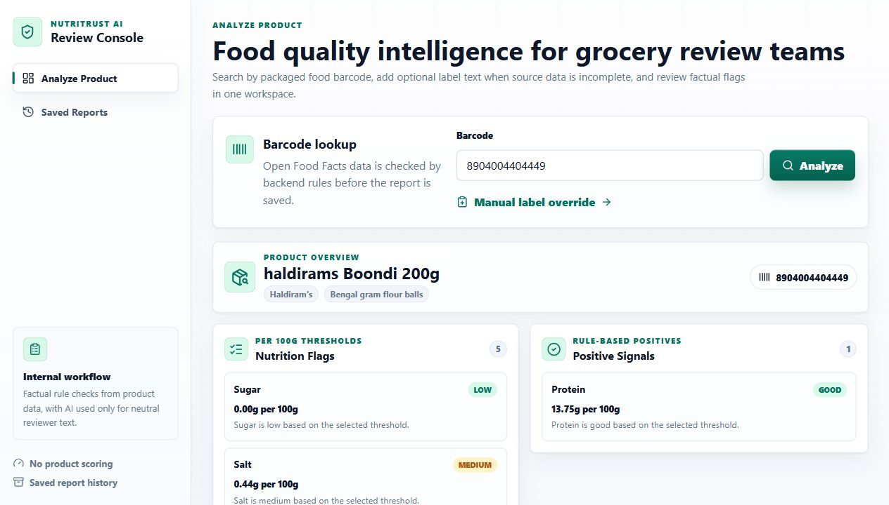
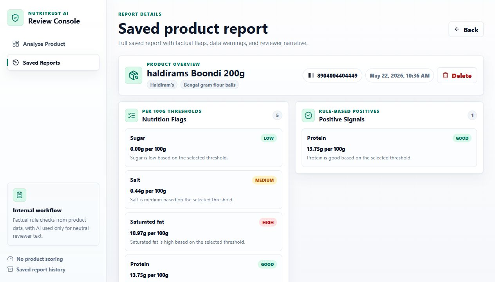
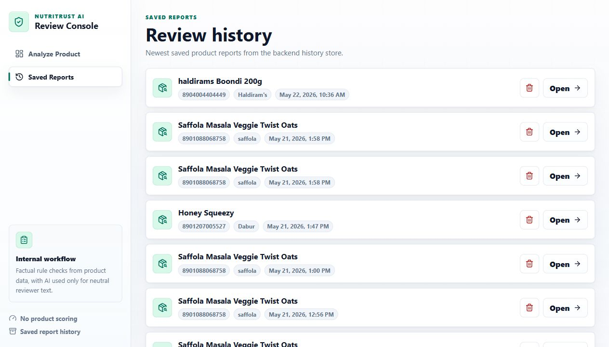
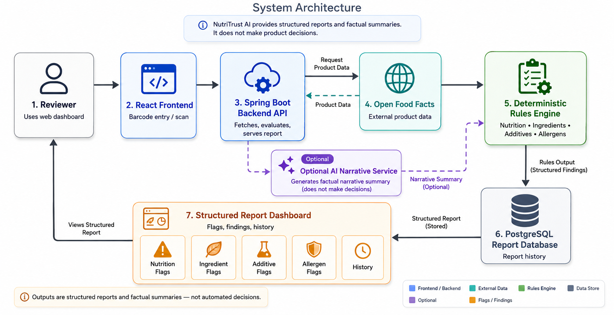
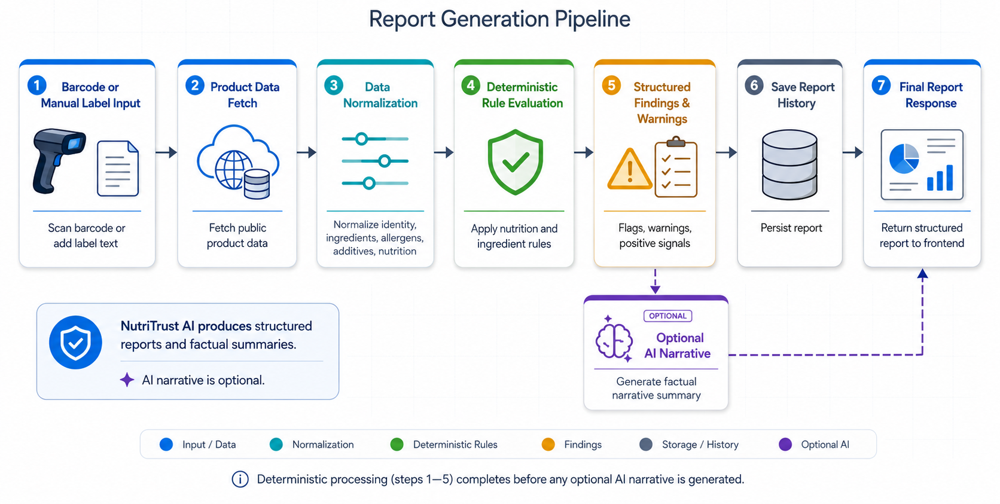
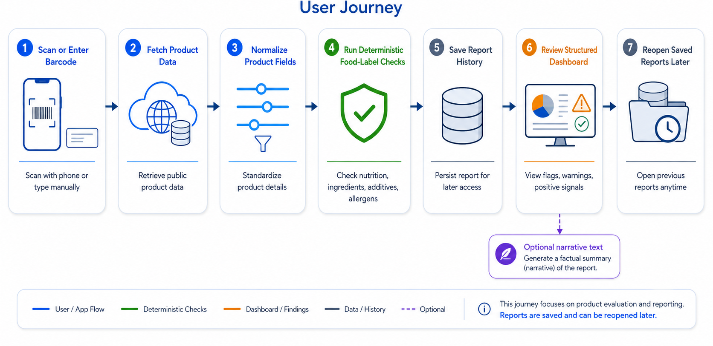

<!-- cspell:ignore Nutri Groq GROQ nutritrust -->

<div align="center">

# NutriTrust AI

### Barcode-based food-label intelligence for structured product review

NutriTrust AI turns public packaged-food data into factual nutrition, ingredient, additive, allergen, and source-quality insights. The backend generates deterministic rule-based findings, while Groq is used only when configured to write a neutral reviewer narrative from those already-generated facts.

<p>
  
  
  
  
  
</p>

<p>
  <a href="#what-it-does">What It Does</a> |
  <a href="#visual-tour">Visual Tour</a> |
  <a href="#architecture">Architecture</a> |
  <a href="#getting-started">Getting Started</a> |
  <a href="#api-reference">API</a> |
  <a href="#quality-checks">Quality Checks</a>
</p>

</div>

---

## What It Does

NutriTrust AI is a full-stack review console for packaged food products. A reviewer enters or scans a barcode, the backend fetches the matching Open Food Facts record, deterministic rules evaluate the label, and the frontend presents a structured report that can be saved for later review.

The important design principle is simple:

> Rules create facts. AI writes summaries. Reviewers make decisions.

Groq never creates product flags, assigns product scores, invents allergens, or decides whether a product is acceptable. It only receives structured findings produced by the backend and writes a reviewer-friendly narrative when an API key is available.

## Visual Tour

| Analyze Product | Report Details | Saved Reports |
| --- | --- | --- |
|  |  |  |
| Enter or scan a barcode, then add manual label text when public data is incomplete. | Review nutrition flags, positive signals, ingredient groups, additives, allergens, source warnings, and narrative text. | Browse saved reports persisted by the backend, with duplicate handling for unchanged deterministic content. |

## Core Capabilities

| Area | What NutriTrust AI Provides |
| --- | --- |
| Barcode lookup | Fetches live product data from Open Food Facts by EAN, UPC, or other numeric packaged-food barcode. |
| Nutrition analysis | Evaluates calories, fat, sugar, salt, sodium, saturated fat, trans fat, cholesterol, carbohydrates, protein, and fiber using configured thresholds. |
| Positive signals | Highlights favorable nutrition outcomes such as low sugar, low salt, low saturated fat, and good protein or fiber values. |
| Ingredient review | Combines source ingredient text, manual label text, Open Food Facts ingredient tags, and local taxonomy data. |
| Additive detection | Reads additive arrays, original additive tags, legacy additive fields, additive codes in ingredient text, and additive taxonomy classes. |
| Allergen detection | Uses allergen fields, trace fields, ingredient text, and taxonomy-backed ingredient links. |
| Data-quality warnings | Warns when public product data is missing, incomplete, or only partially usable for a review area. |
| Manual fallback | Lets reviewers paste ingredient, allergen, trace, and nutrition notes when the public record is incomplete. |
| Saved reports | Persists generated reports in PostgreSQL and avoids duplicate history rows when deterministic content has not changed. |
| AI narrative | Uses Groq only for neutral explanatory text. A local fallback narrative keeps reports usable without an API key. |
| Camera scanning | Supports browser-based barcode scanning through the React frontend, including an HTTPS helper for phone testing. |
| Test coverage | Includes backend unit tests, frontend lint/build checks, taxonomy importer tests, and Groq connectivity tooling. |

## Technology Stack

| Layer | Tools |
| --- | --- |
| Frontend | React, TypeScript, Vite, TanStack Query, React Router, ZXing browser scanner, Motion, Lucide icons |
| Backend | Java 17, Spring Boot, Spring Web, Spring Data JPA, validation |
| Database | PostgreSQL |
| External data | Open Food Facts API and generated taxonomy resources |
| AI narrative | Groq Chat Completions API, optional |
| Testing | JUnit 5, Mockito, AssertJ, Node test runner, ESLint, TypeScript build |
| Local tooling | Windows backend launcher, HTTPS frontend helper, Groq test script, taxonomy importer |

## Architecture

### System Architecture



The system is organized as a reviewer-facing React console, a Spring Boot API, live Open Food Facts data retrieval, deterministic taxonomy-backed rules, PostgreSQL persistence, and an optional AI narrative service. The report response returns to the same frontend so the reviewer can inspect structured findings and saved history.

Primary flow:

1. Reviewer enters or scans a packaged-food barcode.
2. React sends the request to the Spring Boot REST API.
3. The backend fetches the product record from Open Food Facts.
4. The rules engine evaluates nutrition values, ingredient text, additives, allergens, and source completeness.
5. Deterministic report content is saved in PostgreSQL.
6. Groq optionally writes a neutral narrative from the generated facts.
7. The frontend renders the structured report dashboard.

### Report Generation Pipeline



Report generation is intentionally deterministic before any AI step happens.

| Stage | Responsibility |
| --- | --- |
| Barcode or manual input | Accept a barcode and optional reviewer-supplied label text. |
| Product lookup | Fetch raw product JSON from Open Food Facts. |
| Normalization | Merge source and manual ingredient/allergen text, normalize tags, extract nutriments, and prepare source fields. |
| Rule evaluation | Apply nutrition thresholds, taxonomy matching, additive detection, allergen checks, and data-quality rules. |
| Structured findings | Produce nutrition flags, ingredient flags, additive flags, allergen flags, positive signals, and warnings. |
| Persistence | Save the deterministic report, or skip duplicate insertion when the newest saved report is identical. |
| Narrative | Ask Groq for reviewer text only when configured; otherwise use a local fallback report. |
| Response | Return a single report payload to the frontend. |

### AI Safety Boundary

AI is deliberately downstream of deterministic checks. The app treats AI as a narrative layer, not as a source of product facts or product decisions.

Text flow:

```text
Product label data
  -> Deterministic backend rules
  -> Structured factual findings
  -> Optional AI narrative writer
  -> Reviewer-facing report
  -> Reviewer judgment
```

Guardrail summary:

| Boundary Rule | Meaning |
| --- | --- |
| No AI-generated flags | Nutrition, ingredient, additive, allergen, and positive-signal outputs come from backend rules only. |
| No hidden inference | The app does not infer unseen allergens, ingredients, or nutrition facts. |
| No product approval | The app does not approve, reject, rank, or score products. |
| Source-aware wording | Empty sections and warnings distinguish "none detected" from "not enough data to evaluate." |
| Reviewer control | The reviewer remains responsible for the final interpretation and decision. |

### User Journey



Typical reviewer workflow:

1. Scan or enter a barcode.
2. Fetch the product record from Open Food Facts.
3. Normalize product identity, ingredients, allergens, additives, and nutrition values.
4. Run factual backend checks.
5. Save report history.
6. Review the dashboard sections.
7. Reopen saved reports when needed.

## Project Structure

| Path | Purpose |
| --- | --- |
| `.github/workflows` | GitHub Actions CI configuration |
| `docs/images` | README diagram assets |
| `frontend` | React and TypeScript client application |
| `frontend/src/components` | Shared report and shell UI components |
| `frontend/src/pages` | Analyze, report detail, saved reports, and not-found pages |
| `src/main/java/com/nutritrust` | Spring Boot backend source |
| `src/main/resources/application.properties` | Backend configuration |
| `src/main/resources/flag-rules` | JSON rule packs for nutrition, ingredients, additives, and allergens |
| `src/main/resources/openfoodfacts-taxonomies` | Local taxonomy resources used by the rule engine |
| `src/test/java` | Backend test suite |
| `tools` | Taxonomy importer and bundled Maven tooling |
| `.env.example` | Safe environment-variable template |
| `run-backend.bat` | Windows backend launcher with environment and database preflight checks |
| `run-dev-https.ps1` | HTTPS frontend launcher for phone camera testing |
| `test-groq.ps1` | Groq connectivity test script |
| `view-report.ps1` | CLI helper for viewing generated reports |

## Getting Started

### Prerequisites

Install or prepare:

- Java 17 or newer
- Node.js 24 or newer and npm
- PostgreSQL
- Maven 3.9 or newer, or use the bundled Windows Maven path at `tools/apache-maven-3.9.9/bin/mvn.cmd`
- Optional Groq API key for generated narrative text

### 1. Clone And Enter The Project

```powershell
git clone <your-repo-url>
cd nutritrust-ai
```

If you are already in the local workspace, use:

```powershell
cd "C:\Users\Asus\Desktop\food grade"
```

### 2. Create The PostgreSQL Database

Open PostgreSQL with your preferred client and create the database:

```sql
CREATE DATABASE nutritrust;
```

The local development configuration uses Hibernate schema updates, so application tables are created or updated automatically when the backend starts.

### 3. Configure Environment Variables

The backend reads secrets from environment variables. Do not commit real database passwords or API keys.

PowerShell for the current terminal:

```powershell
$env:DATABASE_URL="jdbc:postgresql://localhost:5433/nutritrust"
$env:DATABASE_USERNAME="postgres"
$env:DATABASE_PASSWORD="your_postgres_password"
$env:GROQ_API_KEY="your_groq_api_key"
```

PowerShell for future terminals:

```powershell
setx DATABASE_URL "jdbc:postgresql://localhost:5433/nutritrust"
setx DATABASE_USERNAME "postgres"
setx DATABASE_PASSWORD "your_postgres_password"
setx GROQ_API_KEY "your_groq_api_key"
```

macOS or Linux:

```bash
export DATABASE_URL="jdbc:postgresql://localhost:5433/nutritrust"
export DATABASE_USERNAME="postgres"
export DATABASE_PASSWORD="your_postgres_password"
export GROQ_API_KEY="your_groq_api_key"
```

Notes:

- `DATABASE_PASSWORD` must match your local PostgreSQL password.
- `GROQ_API_KEY` is optional. Without it, report generation still works with a local fallback narrative.
- If your PostgreSQL server uses port `5432`, update `DATABASE_URL` accordingly.

### 4. Install Frontend Dependencies

```powershell
cd frontend
npm install
cd ..
```

### 5. Start The Backend

Windows launcher:

```powershell
.\run-backend.bat
```

The launcher reads environment variables from the current terminal first, then from your Windows user environment. It also checks for a missing password and attempts a PostgreSQL preflight when `psql.exe` is available.

Any system with Maven installed:

```bash
mvn spring-boot:run
```

Bundled Maven on Windows:

```powershell
.\tools\apache-maven-3.9.9\bin\mvn.cmd spring-boot:run
```

Verify the backend:

```powershell
curl.exe http://localhost:8080/api/health
```

Expected response:

```json
{
  "status": "UP",
  "service": "NutriTrust AI"
}
```

If PostgreSQL rejects the password, update it in the same terminal and restart:

```powershell
$env:DATABASE_PASSWORD="your_actual_postgres_password"
.\run-backend.bat
```

### 6. Start The Frontend

Open a second terminal:

```powershell
cd frontend
npm run dev
```

Open:

```text
http://localhost:5173
```

### 7. Optional Phone Camera Testing

Camera access on phones usually requires HTTPS. Start the HTTPS dev server:

```powershell
.\run-dev-https.ps1
```

Use the displayed local-network URL from your phone while both devices are on the same Wi-Fi network.

## API Reference

### Health

```http
GET /api/health
```

### Barcode Lookup

```http
GET /api/products/barcode/{barcode}
```

Returns product identity, source ingredient/allergen fields, additive tags, image URL, and selected nutrition values.

### Generate Report

```http
GET /api/products/report/{barcode}
```

Generates a report from source data only.

### Generate Report With Manual Label Text

```http
POST /api/products/report
Content-Type: application/json

{
  "barcode": "8901030900112",
  "manualIngredientsText": "paste ingredient text here",
  "manualAllergenText": "paste allergen and trace declarations here",
  "manualNutritionNote": "optional reviewer note"
}
```

Manual fields are merged with source data. Nutrition flags still depend on structured nutrition values from the product source.

### Saved Reports

```http
GET /api/reports
GET /api/reports/{id}
DELETE /api/reports/{id}
```

### Report Response Shape

```json
{
  "found": true,
  "barcode": "8901088068758",
  "productName": "Example Product",
  "brand": "Example Brand",
  "category": "Breakfast foods",
  "ingredientText": "source ingredient text used for rule checks",
  "nutritionFlags": [],
  "ingredientFlags": [],
  "additiveFlags": [],
  "allergenFlags": [],
  "positiveSignals": [],
  "dataQualityWarnings": [],
  "aiReport": "Product Overview:\n..."
}
```

## Rule Packs

Rules live under `src/main/resources/flag-rules`.

| File | Purpose |
| --- | --- |
| `nutrition-rules.json` | Per-100g nutrition thresholds and positive-signal levels |
| `ingredient-rules.json` | Configured ingredient review categories and matched terms |
| `additive-rules.json` | Additive taxonomy class explanations and grouping |
| `allergen-rules.json` | Allergen and trace detection rules |

Taxonomy resources live under `src/main/resources/openfoodfacts-taxonomies` and are generated from Open Food Facts taxonomy data. The rule engine combines configured rules with taxonomy metadata so reports can explain what was matched and why it matters.

## Quality Checks

Run these before committing changes:

| Check | Command |
| --- | --- |
| Backend unit tests | `.\tools\apache-maven-3.9.9\bin\mvn.cmd test` |
| Clean backend test run | `.\tools\apache-maven-3.9.9\bin\mvn.cmd clean test` |
| Taxonomy importer tests | `node --test tools\taxonomy-importer.test.mjs` |
| Frontend lint | `cd frontend; npm run lint` |
| Frontend production build | `cd frontend; npm run build` |
| Groq connectivity | `.\test-groq.ps1` |

## Troubleshooting

| Issue | Fix |
| --- | --- |
| `DATABASE_PASSWORD is not set` | Set `DATABASE_PASSWORD` in the current terminal or with `setx`, then restart the backend. |
| `PostgreSQL rejected it` | Confirm the PostgreSQL username, password, host, port, and database name in `DATABASE_URL`. |
| Frontend says it cannot connect to backend | Start Spring Boot on port `8080` or set `VITE_API_BASE_URL` if using a different backend URL. |
| Product not found | Confirm the barcode digits and whether the product exists in Open Food Facts. |
| No AI narrative | Set `GROQ_API_KEY`; otherwise the app intentionally uses local fallback report text. |
| Camera scanner blocked | Use `localhost`, `127.0.0.1`, or the HTTPS helper script for phone testing. |
| Empty flags or warnings | Open Food Facts may have incomplete product data. Use manual label text where available and review data-quality warnings. |

## Development Notes

- Product flags are generated by backend rules, not by AI.
- Saved reports compare deterministic content to avoid repeated identical history rows.
- The app is source-data aware: "not evaluated" and "none detected" are treated differently.
- `.env`, `.env.*`, dependency folders, build outputs, logs, browser profiles, and local tooling binaries are ignored by Git.
- Real API keys and database passwords should stay in environment variables only.

## Limitations

- Open Food Facts is community-maintained, so records may be incomplete, outdated, duplicated, or inconsistent.
- NutriTrust AI does not provide medical advice.
- NutriTrust AI does not approve, reject, certify, rank, or score products.
- All allergen and ingredient findings depend on available source data and reviewer verification.
- Reviewer judgment remains required for final product decisions.

## Future Improvements

- Docker Compose setup for PostgreSQL, backend, and frontend
- Authentication for saved report history
- Region-specific rule packs
- Deployed demo environment
- CI badge once the repository URL is finalized
- More export formats for reviewer reports

---

<div align="center">

**Transparent rules for product facts. AI only for reviewer-friendly narrative text.**

</div>
